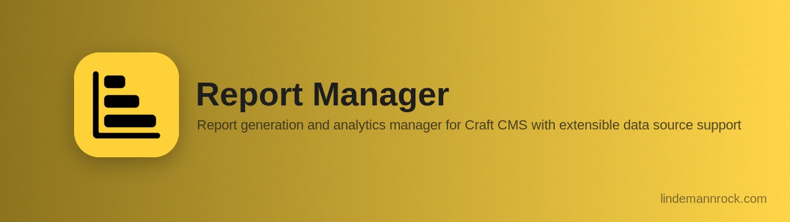

# Report Manager for Craft CMS

[](https://packagist.org/packages/lindemannrock/craft-report-manager)
[](https://craftcms.com/)
[](https://php.net/)
[](https://github.com/LindemannRock/craft-logging-library)
[](LICENSE)

Saved reporting, content inventory, and export management for Craft CMS with extensible data source support.

## License

This is a commercial plugin licensed under the [Craft License](https://craftcms.github.io/license/). It will be available on the [Craft Plugin Store](https://plugins.craftcms.com) soon. See [LICENSE.md](LICENSE.md) for details.

## ⚠️ Pre-Release

This plugin is in active development and not yet available on the Craft Plugin Store. Features and APIs may change before the initial public release.

## Features

- **Saved Reports** — Define a report once (data source, entities, fields, date range, format) and generate exports from it on demand
- **Data Sources** — Built-in Craft Entries, Craft Categories, and Formie submissions; extensible for custom sources
- **Date Filtering** — Named or custom date ranges, applied to a date field you choose per source
- **Export Formats** — CSV (configurable delimiter/enclosure, optional Excel BOM), Excel (XLSX), and JSON
- **Separate or Combined** — One file per entity, or all entities merged into a single file
- **Scheduling** — Run reports automatically from every 6 hours through yearly, via Craft's queue
- **Export Management** — Queue-based generation with live progress, status tracking, and re-downloadable files
- **Flexible Storage** — Store exports on the local filesystem or in a Craft asset volume
- **Retention & Cleanup** — Automatic, configurable cleanup of old exports
- **Multi-Site** — Limit reports to specific sites; exports include site ID, handle, and name
- **Queued Export Providers** — A developer API for other plugins to push table, workbook, or multi-file exports through Report Manager's queue

## Requirements

- Craft CMS 5.0+
- PHP 8.2+
- [Logging Library](https://github.com/LindemannRock/craft-logging-library) 5.0+ — optional, install in CP for log viewing
- [Formie](https://verbb.io/craft-plugins/formie) 3.0+ — optional, enables the Formie data source

## Installation

### Via Composer

```bash
composer require lindemannrock/craft-report-manager
```

```bash
php craft plugin/install report-manager
```

### Using DDEV

```bash
ddev composer require lindemannrock/craft-report-manager
```

```bash
ddev craft plugin/install report-manager
```

## Documentation

Full documentation is available in the [docs](docs/) folder.

## Support

- **Issues**: [GitHub Issues](https://github.com/LindemannRock/craft-report-manager/issues)
- **Email**: [support@lindemannrock.com](mailto:support@lindemannrock.com)

## License

This plugin is licensed under the [Craft License](https://craftcms.github.io/license/). See [LICENSE.md](LICENSE.md) for details.

---

Developed by [LindemannRock](https://lindemannrock.com)
